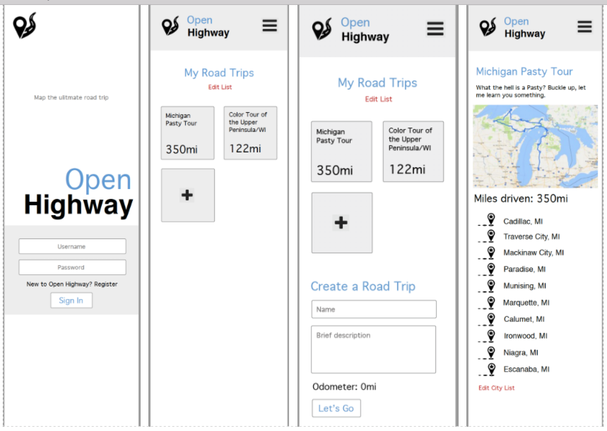

<h1>Open Highway</h1>
<h2>Design</h2>

The interface design was created initially in mobile view. A hamburger dropdown menu provides the user with the options for a few of the main page views, such as a user dashboard and a logout that redirects to the main page landing.

<h2>Technologies Used</h2>

The Open Highway API is a RESTful API built in Rails with a PostgreSQL database. The front end app is created with AngularJS and an ExpressJS Server that serves static files. Map functionality is provided by Google Maps API, and user authentication is accomplished using bcrypt. All CSS formatting was created from scratching using SCSS pre-processing. High fidelity wireframes were created using Sketch, and scrum workflow was managed through Git branching, GitHub, and Trello. Both servers are hosted on Heroku.

<h2>Approach Taken</h2>

Our group took an ambitious approach to this project. We set out to create an API that serves four related data models, and a frontend app that would interact with two additional third-party API's. The most valuable takeaway from this ambitious approach has been the steep and fast learning curve we've inevitably tumbled over. Each group member took on a research project to learn something totally brand new (Ellen explored SCSS, Mark researched authentication, and Dylan integrated the Google Maps API). We each learned a lot of new technologies from biting off more than we could chew.

<h2>Future Optimizations</h2>
<ul>
  <li>We set out with the intention of building an "attractions" list that belongs to each city within a roadtrip - a list of spots to visit within the vicinity. This is built into the database architecture, but it is not implemented on the frontend.</li>
  <li>Build a column within the user's model to keep track of a user's roadtrip games. Ideas include roadtrip bingo, slugabug counter, counter leaderboards for global scorekeeping, or other variations of common roadtrip games.</li>
  <li>Find a way to display the total miles of all routes within a roadtrip, from origin to final destination, or a trip odometer</li>
</ul>

<h2>Unsolved Issues</h2>
<ul>
  <li>If you try to add an invalid city to a roadtrip, and there is already just one city in the queue before it, the marker for that first valid city will disappear.</li>
  <li>If you delete a roadtrip, the cities persist in the database. You can't access them unless by city ID.</li>
</ul>
